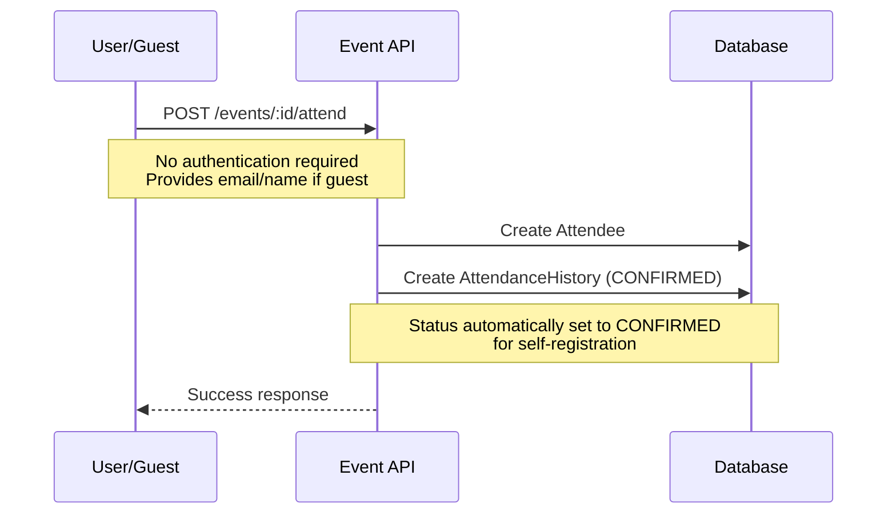
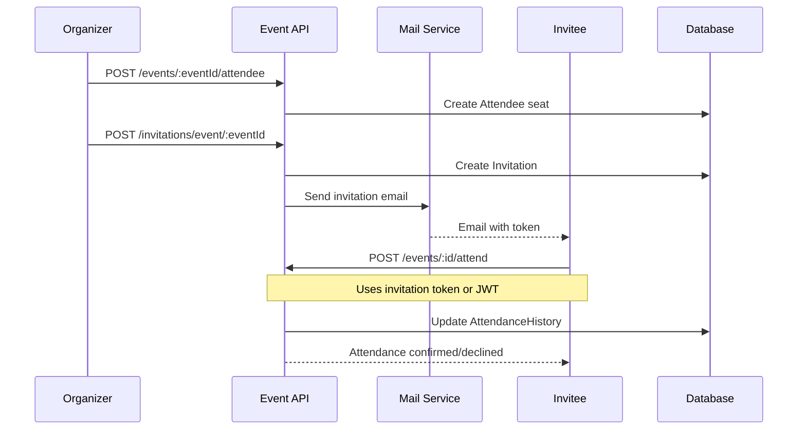
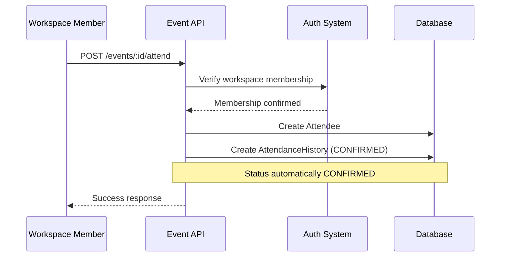
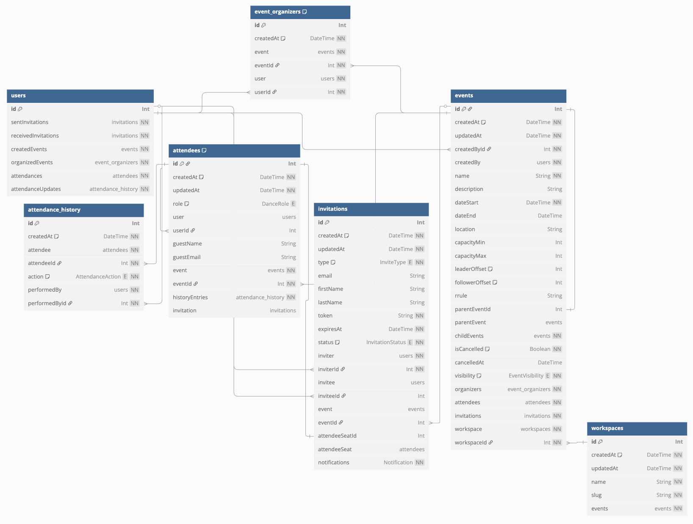

# Event Module Documentation

## Overview

The Event module manages dance events within workspaces.

Events can have different **visibility levels** and support **recurring schedules**.

Workspace teachers and owners can create and manage events, while attendance is handled through a flexible system **supporting both registered users and anonymous guests**.

## Event Types by Visibility

| Event Type | Who Can See | Who Can Attend | Access Requirements |
|------------|-------------|----------------|-------------------|
| **Public** (`PUBLIC`) | Everyone (users, workspace members, anonymous visitors) | Everyone (anonymous guests provide email/name) | No authentication required |
| **Workspace** (`WORKSPACE_ONLY`) | Workspace members only | Workspace members only | Workspace membership required |
| **Invitation-Only** (`INVITATION_ONLY`) | Only invited users and organizers | Only invited users | Valid invitation token required |

## Key Concepts

### Event Organizers
- **Creator**: User who creates the event (automatically becomes first organizer)
- **Additional Organizers**: Can be added by existing organizers via `additionalOrganizerIds`
- **Permissions**: All organizers can update event details, cancel events, and manage attendees

### Attendees vs Attendance History
- **Attendee**: Represents a person's registration for an event
- **AttendanceHistory**: Records all changes to attendance status (REGISTERED, CANCELLED, DECLINED, REMOVED)
- **Flow**: Creating an attendee automatically creates initial history entry with `REGISTERED` action

### Recurring Events
- **Parent Event**: Defines the recurrence pattern using iCalendar RRULE
- **Child Events**: Individual occurrences of the recurring event
- **Attendance**: 
  - Updating parent event attendance affects all child events
  - Individual child events can be updated independently

## API Endpoints

### Event Management

#### Create Event
```
POST /workspace/:slug/events
```
- **Access**: Teachers, Owners
- **Body**: `CreateEventDto`
- **Returns**: `EventResponseDto`

#### Get Workspace Events  
```
GET /workspace/:slug/events
```
- **Access**: Based on event visibility
- **Query**: `SearchEventsDto`, pagination
- **Returns**: `PaginatedResponseDto<EventResponseDto>`

#### Get Event Details
```
GET /workspace/:slug/events/:id
```
- **Access**: Based on event visibility
- **Returns**: `EventResponseDto`

#### Update Event
```
PATCH /workspace/:slug/events/:id
```
- **Access**: Event organizers
- **Body**: `UpdateEventDto`
- **Returns**: `EventResponseDto`

#### Cancel Event
```
POST /workspace/:slug/events/:id/cancel
```
- **Access**: Event organizers
- **Body**: `CancelEventDto`
- **Returns**: `EventResponseDto`

### Attendee Management

#### Create Attendee (by Organizers)
```
POST /workspace/:slug/events/:eventId/attendee
```
- **Access**: Event organizers
- **Body**: `CreateAttendeeDto`
- **Purpose**: Add users or guests to event
- **Returns**: `AttendeeResponseDto[]`

#### Update Attendance (by Attendees)
```
POST /workspace/:slug/events/:id/attend
```
- **Access**: Public (no JWT required)
- **Body**: `AttendEventDto`
- **Purpose**: Confirm/cancel/decline attendance
- **Auth**: Validated based on event visibility and attendee rights

## Attendance Flows

### 1. Public Event Self-Registration



**Flow Steps:**
1. Anyone views public event (no authentication needed)
2. User/guest calls `POST /events/:id/attend` with their details
3. System creates attendee seat automatically
4. AttendanceHistory entry created with `REGISTERED` action
5. **Status automatically becomes CONFIRMED** for self-registration

### 2. Organizer-Managed Invitation Flow



**Flow Steps:**
1. Organizer creates attendee seat via `POST /events/:eventId/attendee`
2. Organizer sends invitation via `POST /invitations/event/:eventId`
3. System sends email with invitation token
4. Invitee confirms/declines via `POST /events/:id/attend`
5. AttendanceHistory updated with user's choice

### 3. Workspace Member Direct Registration



**Flow Steps:**
1. Workspace member views workspace event
2. Member calls `POST /events/:id/attend` with JWT
3. System verifies workspace membership
4. Attendee seat created automatically
5. Status automatically becomes CONFIRMED

## Data Models

### Event Properties
- **Basic Info**: name, description, dateStart, dateEnd, location
- **Capacity**: capacityMin, capacityMax, leaderOffset, followerOffset
- **Visibility**: PUBLIC, WORKSPACE_ONLY, INVITATION_ONLY
- **Recurrence**: rrule (iCalendar format), parentEventId
- **Status**: isCancelled, cancelledAt

### Attendee Properties
- **User Info**: userId (for registered users) OR guestEmail/guestName (for guests)
- **Preferences**: role (LEADER/FOLLOWER)
- **Status**: Derived from latest AttendanceHistory entry
- **Invitation**: Link to invitation that brought them to event (if applicable)

### Attendance Actions
- **REGISTERED**: User signed up for event
- **CANCELLED**: User cancelled their attendance  
- **DECLINED**: User declined invitation
- **REMOVED**: User was removed by organizer

## Permission Matrix

| Action | Public Event | Workspace Event | Invitation-Only Event |
|--------|-------------|-----------------|----------------------|
| View Event | Anyone | Workspace Members | Invited Users + Organizers |
| Create Event | Teachers, Owners | Teachers, Owners | Teachers, Owners |
| Register Himself | Anyone | Workspace Members | Organizers Only |
| Update Attendance | Attendee/Organizers | Attendee/Organizers | Attendee/Organizers |
| Manage Event | Organizers | Organizers | Organizers |
| Add Other Attendees | Organizers | Organizers | Organizers |
| Send Invitations | Attendees/Organizers | Organizers | Organizers |

## Database Schema

